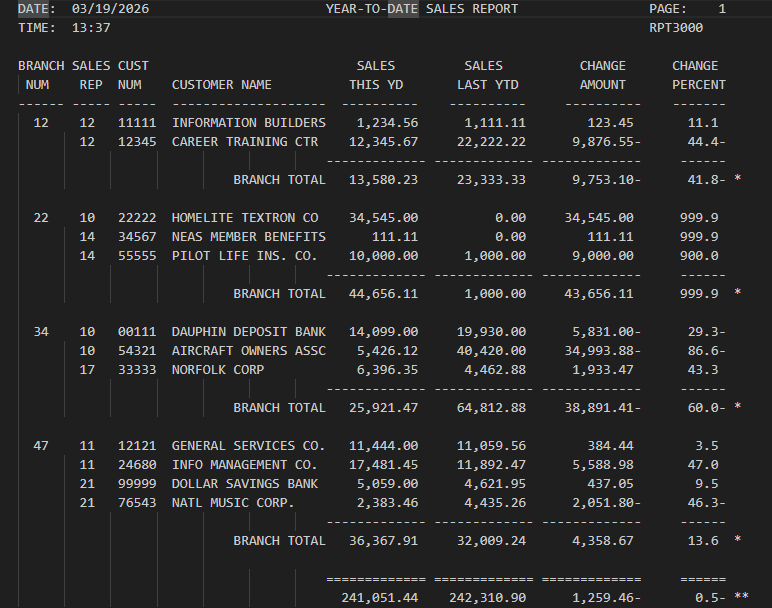

# 📊 RPT3000 – COBOL Sales Report Generator

## 👨‍💻 Authors

[@bstearns07](https://github.com/bstearns07) Ben Stearns 
[@ADunbar5612](https://github.com/ADunbar5612) Aidan Dunbar

📅 **Last Updated:** 03/19/2026  

---

## Table of Contents
- 📌 [Summary](#-summary)
- ⭐ [How It Works](#-how-it-works)
- ✨ [Features](#-features)
- 🧰 [Tech Stack](#-tech-stack)
- 🔧 [Development Tools](#-development-tools)
- 🧩 [Core Concepts](#-core-concepts)
- 📝 [New Topics Covered](#-new-topics-covered)
- 📘 [What I Learned](#-what-i-learned)
- 🖼 [Screenshots](#-screenshots)

## 📌 Summary

**RPT3000** is a COBOL program that reads a customer master file and generates a professionally formatted Year-To-Date (YTD) sales report.

The report includes:

* 🧾 Customer details  
* 📈 Current year sales (YTD)  
* 📉 Previous year sales (YTD)  
* 💲 Dollar change in sales  
* 📊 Percentage change in sales  
* 🧮 Grand totals across all customers  

The output is formatted for readability, mimicking a professional business report layout with headings, alignment, and pagination.

---

## ⭐ How It Works

In order to run this program, please do the following:

Download the provided JCL, COBOL source code, and CUSTMAST file that contains the data this program relies on
Add these files to your IBM mainframe environment
Update the JCL DSN names to match the filepaths of your environment
Submit the JCL job to your mainframe for processing

### 🚀 Initialization

* Opens input and output files  
* Retrieves the current system date and time  
* Prepares report header fields  

### 🔄 Record Processing

* Reads each customer record from the input file  
* For each record:

  * Formats customer information for output  
  * Performs calculations:

    * 💲 **Change Amount** = This YTD − Last YTD  
    * 📊 **Change Percent** = (Change / Last YTD) × 100  

### ⚠️ Edge Case Handling

* If **Last YTD = 0**:

  * Percentage is set to `999.9` to avoid division errors  

### 🖨️ Output Generation

* Writes formatted customer data to the report  
* Updates running totals for:

  * 📈 This YTD sales  
  * 📉 Last YTD sales  

### 🧾 Final Totals

* Calculates grand totals  
* Computes overall percentage change  
* Writes a summary line at the end of the report  

---

## ✨ Features
- 📊 Generates **multi-level sales reports** (customer + branch + grand totals)  
- 🔄 Implements **control-break logic** for branch grouping  
- 📈 Calculates **change amount and percent change**  
- 📄 Produces **multi-page formatted reports** with headers  
- 🧾 Clean, aligned output using **fixed-length record formatting**  
- ⚠️ Handles **divide-by-zero and overflow errors** gracefully  
- 🕒 Includes **dynamic date/time stamping**

---

## 🧰 Tech Stack

- **Enterprise COBOL 6.4** – Core business logic  
- **JCL** – Batch execution (compile/link/run)  
- **IBM z/OS** – Mainframe runtime environment  

---

## 🔧 Development Tools
- 💻 Visual Studio Code + Zowe Explorer  
- 🖥️ IBM z/OS Mainframe  
- 📂 Partitioned Datasets (PDS)  

---

## 📁 Files

| 📄 File Name     | 📌 Description                             |
|------------------|-------------------------------------------|
| `RPT3000.cbl`    | COBOL source program                      |
| `JCLRPT3.jcl`    | JCL used to compile and execute program   |
| `README.md`      | Project documentation                     |

---

## 🧩 Core Concepts

* ⚙️ Values may be hardcoded for demonstration purposes  
* 🔢 Numeric editing is used to format output fields  
* 🎓 Designed for educational use  
* 💡 Demonstrates:

  * Structured COBOL programming  
  * File handling  
  * Report formatting  
  * Business-oriented calculations  

---

## 📝 New Topics Covered
- 🔀 **Control Break Processing** (branch change detection)  
- 📊 **Subtotals & Group Aggregation** (branch-level totals)  
- 🧠 **State Tracking** using control fields (`OLD-BRANCH-NUMBER`)  
- 🔄 **Conditional Output Formatting** (suppressing repeated values)  
- ➗ **Advanced error handling** (`ON SIZE ERROR`, divide-by-zero cases)  

---

## 📘 What I Learned
- How to implement **control-break logic**, a core pattern in enterprise batch systems  
- Managing **grouped data processing and subtotals**  
- Designing **multi-level reports** (detail → subtotal → grand total)  
- Handling **edge cases in financial calculations**  
- Structuring COBOL programs to support **scalable reporting logic**  

## 🖼 Screenshots

### Output

